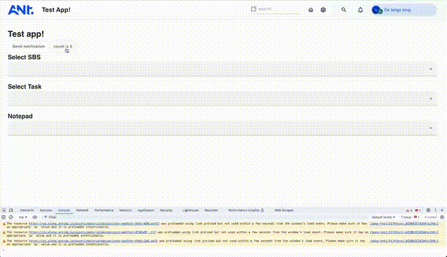

# ANT-OS app template
###### For Vue ✨

This example shows how you can create and publish your own app for ANT-OS.

An app is essentially a single-page website. By using ANT's component library, you'll upgrade suche website to be an ANT application. Within the component library is the comms (short for communications) technology, which enables communication between your app, ANT-OS and even the ANT backend.

Check out [main.ts](./src/main.ts) to see a utility that provides a comms instance and [App.vue](./src/App.vue:7) to see it used in action.

- Through `comms.context` you can [watch and receive](./src/App.vue:36) important changes from the OS, like changes in Project, License and/or User. 
- The `comms.connect` property is the API that enables the ANT system. You can use it as well as the OS itself.
- With `comms.toolbar`, `comms.notepad` and `comms.notifications`, you get partial access to the those respective OS components. Add your custom menu to the upper toolbar, open the Notepad in a specific Task or send a notification.

In upcoming update, you'll get access to current locale and darkmode-state.

## Getting started

Run your favorite `pnpm install` and run the `dev` command from the `package.json`. This will launch the app on localhost port [5174](http://localhost:5174). Now you'll be able to see the app without the connection to ANT OS. 

Next step is the head over to [ANT OS](https://os.antcde.io/) and login. After logging in you can go to `https://os.antcde.io/developer`.

NOTE: some functionality is reflected in the console only.

## Publishing
By running the `build` command, you'll build a single page app that is ready for publishing. Head over to [ANT](https://os.antcde.io) and open the [ANT app store](https://os.antcde.io/apps/1). Here you can create or update your app by uploading the freshly created zip (usually found in the dist dir). 

## app-config.json
If the app requires any initialization on the server, it can be defined within this file. In here you can define the tables you'll need within you app. 